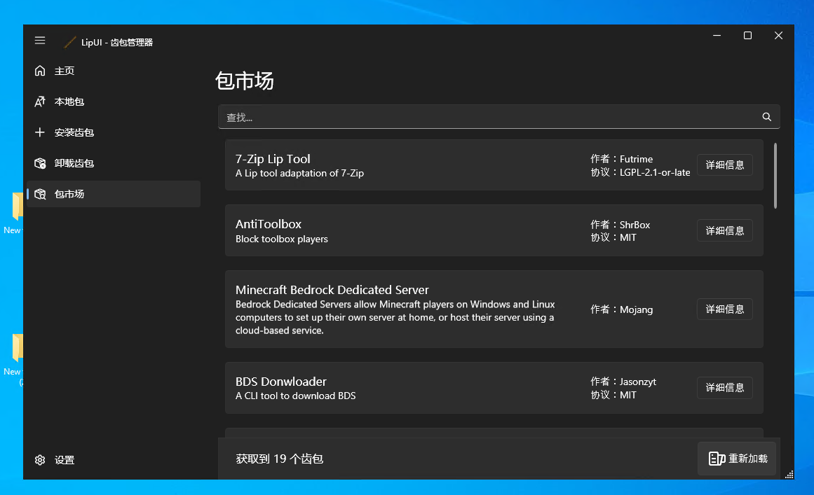

# 安装和使用

## 🍳 我需要掌握什么技能？

如果你认为你自己具备基本的计算机使用能力、互联网使用能力和简单的日常英语水平，我们非常欢迎且推荐你使用LiteLoaderBDS。

如果你在使用中遇到任何问题，请仔细阅读本文档和C++插件开发文档。你遇到的大部分问题应该都可以在文档中找到。如果出现任何报错，请仔细阅读报错信息，并尝试移除插件直到所有插件都被移除。如果问题依然存在，请在GitHub提出issue或帮我们修复问题并发起pull request。

LiteLoaderBDS开发团队大多为学生，不是专职维护者，也不是客服，有较大的学业压力，因此，请不要以除issue外的方式向我们报告任何问题。此外，请不要催促我们做任何事情。

如果你认为你能够接受以上说明，欢迎你加入LiteLoaderBDS的圈子，让我们携手壮大LiteLoaderBDS生态吧！

## 💻 安装LiteLoaderBDS

### 在Windows上安装

我们推荐在以下平台安装，对于其它版本的Windows，我们不保证兼容性。

* Windows Server 2019或更新版本
* Windows 11
* Windows 10 21H2或更新版本

#### 通过LipUI安装

LipUI为LiteLoaderBDS用户带来了前所未有的、优雅的、简洁的安装体验。我们推荐所有缺乏命令行知识的用户使用LipUI来安装LiteLoaderBDS。

你可以观看[视频](https://www.bilibili.com/video/BV1w24y1W7pq)学习通过LipUI安装LiteLoaderBDS

首先你需要安装Lip，请参考[Lip文档](https://lip.docs.litebds.com)。然后，下载[LipUI](https://github.com/LiteLDev/LipUI/releases/latest)并运行。

首先，你需要指定工作路径，这是BDS和LiteLoaderBDS需要放置的目录。如果你不知道该如何选择，请随意新建一个文件夹并选择它。


然后，前往包市场，选择你需要的包进行安装。为了运行LiteLoaderBDS，你需要安装BDS和LiteLoaderBDS。如果你想省事，你也可以直接安装整合包Starter Pack.



包市场中还有各种各样的插件，你可以根据自己的需要进行安装。譬如，你可以安装AntiToolbox来防止玩家使用Toolbox，安装LLAntiCheat来防止玩家使用外挂，安装LLEssentials来为服务器加入联机基础功能。

#### 通过Lip安装

我们推荐具有一定命令行知识的用户使用[Lip](https://lip.docs.litebds.com)来安装LiteLoaderBDS。

你可以观看[视频](https://www.bilibili.com/video/BV1254y1N7gD)学习通过Lip安装LiteLoaderBDS

你需要先安装Lip，请参考[Lip文档](https://lip.docs.litebds.com)。若已经安装Lip，请跟随以下步骤安装LiteLoaderBDS:

对于LiteLoaderBDS 2.10.0-beta.1及更早的版本，并没有提供BDS自动安装机制，你可以运行以下命令安装BDS。请注意版本对应关系。

```shell
lip install bds@1.19.61
```

1. 在BDS目录中运行如下命令：

    ```shell
    lip install ll
    ```

2. 对于LiteLoaderBDS 2.9.3及更早的版本，并没有提供后安装脚本，因此你需要在BDS目录中运行`LLPeEditor.exe`，并等待程序提示关闭以完成后安装任务。

3. 在BDS目录中运行`bedrock_server_mod.exe`来启动服务器。请注意，你应该始终运行`bedrock_server_mod.exe`来启动服务器。

如果你希望安装其它版本的LiteLoaderBDS，你可以运行类似如下的命令：

```shell
lip install ll@2.9.2
```

我们还提供了整合包，你可以通过以下命令安装：

```shell
lip install starterpack
```

#### 手动安装

如果你不想使用Lip，或者你希望进行一些高级操作，你可以手动安装LiteLoaderBDS。该方法可能会因为操作上的细微差别造成本文档中未提及的问题，因此需要你具备较高的排错能力。如果你遇到了任何问题而无法解决，请尝试通过Lip安装。请跟随以下步骤安装:

1. 从<https://github.com/LiteLDev/LiteLoader/releases>下载对应版本的`LiteLoaderBDS.zip`。
2. 解压缩下载得到的文件到BDS目录中。
3. 在BDS目录中运行`LLPeEditor.exe`。
4. 在BDS目录中运行`bedrock_server_mod.exe`以启动服务器。

### 在Linux发行版上安装

经过测试，使用 Wine8.0 或更高版本可以正常在 Linux 服务器上运行最新的 BDS + LiteLoaderBDS，并正常安装插件和进入游戏。如果使用 Linux 服务器的用户可以安装 Wine 后使用 Wine 运行BDS，获得和 Windows平台几乎完全一样的体验和性能。

#### 通过Docker/Podman

即将到来

#### 通过脚本

你需要事先安装好Wine环境，我们推荐使用的版本是8.0+  
在要安装服务器的目录中，运行:

```sh
wget https://raw.githubusercontent.com/LiteLDev/LiteLoaderBDS/develop/scripts/install.sh && sh install.sh
```

## 🚅 更新LiteLoaderBDS

当新的Minecraft基岩版发布时，你需要更新以使得服务端适配最新的客户端。

> [!WARNING]
> 请注意，部分插件、地图等对更新操作有额外要求，若按照以下步骤操作，可能导致数据损坏。请做好数据备份工作。

### 在Windows上更新BDS

更新时，请按照以下步骤操作：

1. 将服务端所在目录内，除 `allowlist.json` 、 `permissions.json` 、 `server.properties` 、 `plugins` 、 `worlds` 外所有文件删除。
2. 将新版LiteLoaderBDS适配的适用于 Minecraft 的 Bedrock 版专属服务端软件（BDS）压缩包中，除 `allowlist.json` 、 `permissions.json` 、 `server.properties` 外所有内容解压到服务端所在目录。此步骤不应出现覆盖提示。
3. 安装新版LiteLoaderBDS。
4. 将备份的文件放回到服务端所在目录，并覆盖同名文件。

### 在Windows上更新LiteLoaderBDS

如果BDS没有更新，但是LiteLoaderBDS有更新，你可以使用Lip进行更新。

在BDS目录中运行：

```shell
lip install --upgrade ll
```

如果你希望更新到特定版本，你可以使用以下命令：

```shell
lip install --upgrade ll@2.9.2
```

如果你希望回退到特定版本，你可以使用以下命令：

```shell
lip install --force-reinstall ll@2.9.2
```

如果你不希望使用Lip，你可以手动更新LiteLoaderBDS，请按照[在Windows上更新BDS](#在Windows上更新BDS)中的步骤操作。

### 在Linux上更新BDS

更新时，请按照以下步骤操作：

1. 备份服务端所在目录内的 `allowlist.json` 、 `permissions.json` 、 `server.properties` 、 `plugins` 、 `worlds` 。
2. 删除服务端。
3. 安装新版LiteLoaderBDS。
4. 将备份的文件放回到服务端所在目录，并覆盖同名文件。

如果BDS没有更新，但是LiteLoaderBDS有更新，你也必须按照以上步骤操作。

## 🎯 安装插件

插件分为原生插件和脚本插件两种。原生插件是经过编译的本地插件，具有更好的性能，但服务器启动后不能再启用或禁用。脚本插件由JavaScript或Lua编写，可以灵活地管理，具有更好的安全性，但性能较差。

> [!WARNING]
> 为了保证大部分插件能够正常运行，请在 `server.properties` 中将 `online-mode` 设为 `true` ，并将 `server-authoritative-movement` 设为 `server-auth` 或 `server-auth-with-rewind` 。

### 寻找您喜爱的插件

你可以在这些网站上寻找插件：

* [Official Lip Registry](https://registry.litebds.com)(仅支持通过Lip安装，推荐)
* [LiteLoaderBDS官方论坛](https://www.litebds.com/)
* [MineBBS (原生插件)](https://www.minebbs.net/resources/?prefix_id=59)
* [MineBBS (脚本插件)](https://www.minebbs.net/resources/?prefix_id=67)

### 通过Lip安装

如果插件作者提供了符合Lip规范的分发仓库，或将插件以Tooth包（后缀名为`.tth`）分发，我们推荐使用[Lip](https://lip.docs.litebds.com)来安装插件，因为Lip可以自动处理依赖关系，使得插件安装、升级和卸载更加方便。

你需要先安装Lip，请参考[Lip文档](https://lip.docs.litebds.com)。

如果你需要添加来自分发仓库的插件，请使用类似如下的命令进行安装：

```shell
lip install example.com/exampleuser/exampleplugin
```

如果插件已经被提交到Lip Registry，则可以通过短名称安装插件，例如：

```shell
lip install llanticheat
```

如果你已经获得了Tooth包文件，请使用类似如下的命令进行安装：

```shell
lip install myplugin.tth
```

Lip还提供了Tooth包文件URL的安装支持，例如：

```shell
lip install https://example.com/myplugin.tth
```

你可以运行类似如下命令移除插件：

```shell
lip uninstall example.com/exampleuser/exampleplugin
```

如果你需要移除插件，但不知道插件的Tooth路径，可以运行如下命令查询所有已经安装的Tooth包：

```shell
lip list
```

如果你不确定某个Tooth包是否为你需要移除的插件，你可以运行类似如下命令查看插件详情：

```shell
lip show example.com/exampleuser/exampleplugin
```

### 手动安装

如果你不想使用Lip，或者插件并未提供Lip支持的分发方式，你可以手动安装插件。但是，手动安装插件需要你自己处理依赖关系，可能会导致插件无法正常运行。

如果插件提供了安装指南，请按照指南进行操作。如果没有，请将插件所有内容放入 `plugins` 文件夹中。

如果你需要移除插件，直接将添加插件时放入的文件移除即可。

## 🔌 管理插件

你可以用下面列出的命令来管理这些插件：

* `ll list`：列出插件
* `ll load plugins/xxx.js`：加载一个脚本插件
* `ll unload plugin/xxx.js`：卸载一个脚本插件
* `ll reload plugin/xxx.js`：重新加载一个脚本插件
* `ll reload`：重新加载所有脚本插件
* `ll version`：打印LiteLoaderBDS版本
* `ll upgrade`：检查LiteLoaderBDS的更新

### 注意事项

* 卸载一个插件后，它所注册的命令不会被完全删除，这可能会导致玩家在试图使用该命令时提示该命令不存在。
* 如果卸载的插件导出的接口被其他插件使用，其他插件将无法使用。
* 当服务器尚未启动或有玩家在服务器中时，不要卸载或重新加载插件，否则服务器将面临崩溃的风险。
* 在加载一个插件时，`onServerStarted`事件和所有玩家的`onPlayerJoin`事件将在该插件中被触发。

> [!WARNING]
> 不要在生产环境下加载、卸载或重新加载任何插件。

## 🎨 安装附加包

将文件名以`.mcpack`、`.mcaddon`或`.zip`结尾的附加包复制到`plugins/AddonsHelper/`并重新启动服务器。然后，这些附加包将被自动添加到世界中。

你可以在控制台使用 `addons` 命令来管理它们。